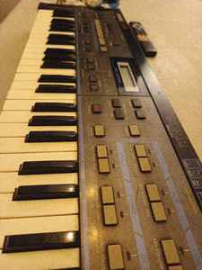
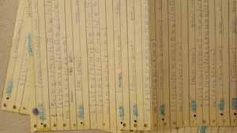
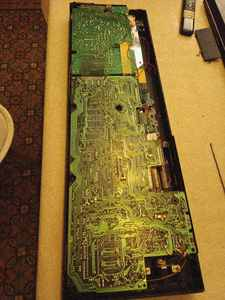
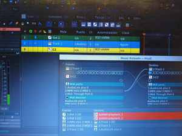

# ISLA

## Una estación libre de producción musical

**ISLA** es un proyecto para construir una estación de producción musical completa sobre GNU/Linux utilizando **software libre, estándares abiertos, hardware reparable y conocimiento reproducible**.

*Una de las máquinas que dieron origen a ISLA: hardware de los años 80 reintegrado a una estación GNU/Linux actual.*

No nació como una distribución ni como una colección de plugins. Nació intentando volver a integrar instrumentos reales de distintas épocas —Casio CZ-101, Ensoniq SQ-1, Kawai K1r y otros— con una estación moderna sin depender de sistemas operativos propietarios, drivers cerrados, activaciones remotas ni formatos cautivos.

En el camino hubo que hacer bastante más que instalar un DAW:

- recuperar y diagnosticar sintetizadores de los años 80 y 90;
- convertir anotaciones manuscritas de patches en datos nuevamente utilizables;
- desarrollar un librarian Web MIDI para el Casio CZ-101;
- extender un driver libre de kernel para que una Midiplus AudioLink Plus II pudiera funcionar correctamente bajo GNU/Linux;
- corregir transmisión MIDI/SysEx hasta obtener transferencias de miles de bytes sin corrupción;
- reconstruir en software la arquitectura de un Korg Poly-800 perdido, dando origen a **ISLA 800**;
- estudiar la recuperación de bancos, secuencias y disquetes históricos del Ensoniq SQ-1;
- integrar hardware, instrumentos virtuales libres y audio multipista alrededor de **MusE**.

> **La computadora y los instrumentos deben estar al servicio del músico, y no el músico sometido a las restricciones de una plataforma, una licencia, un fabricante o un formato cerrado.**

## El proyecto, en imágenes

### Del papel al sonido

*Parámetros conservados durante décadas. En ISLA estas hojas se tratan como código fuente histórico: se transcriben, estructuran y vuelven a convertirse en patches utilizables.*

### Reparar antes que descartar

*La restauración física y la preservación digital son dos caras del mismo trabajo.*

### Cuando el driver no existe

*La AudioLink Plus II terminó funcionando bajo GNU/Linux mediante trabajo sobre el driver libre Ozzy, incluyendo la corrección del transporte MIDI/SysEx.*

### Un estudio híbrido

*MusE integra MIDI, hardware real, retornos de audio e instrumentos virtuales dentro de una misma sesión.*

## Principios

1. **Software libre** — las piezas esenciales deben poder estudiarse, modificarse, compilarse y conservarse.
2. **Estándares abiertos** — MIDI, SysEx, WAV, ALSA, JACK y LV2 permiten que tecnologías de décadas diferentes sigan dialogando.
3. **Reparabilidad** — la falta de soporte comercial no convierte automáticamente al hardware en residuo electrónico.
4. **Preservación** — un patch, una secuencia, un sonido o un instrumento también son patrimonio tecnológico y musical.
5. **Reproducibilidad** — cada descubrimiento importante debería terminar convertido en código, documentación, presets, imágenes de disco, SysEx o procedimientos reconstruibles.

## Documentación

- [Historia y filosofía](HISTORY.md)
- [Arquitectura técnica](ARCHITECTURE.md)
- [Preservación tecnológica musical](PRESERVATION.md)
- [Casio CZ-101](docs/cz101.md)
- [Midiplus AudioLink Plus II](docs/audiolink.md)
- [ISLA 800 / Poly-800](docs/isla800.md)
- [Ensoniq SQ-1 y archivos históricos](docs/ensoniq-sq1.md)
- [MusE como centro de producción](docs/muse.md)
- [Archivo visual](media/README.md)

## Licencias

La documentación, diagramas y fotografías propias de este repositorio se publican bajo **CC BY-SA 4.0** salvo indicación contraria. Los proyectos de software enlazados conservan sus respectivas licencias de software libre.

> **No se trata solamente de hacer música con software libre. Se trata de garantizar que podamos seguir haciéndola dentro de cuarenta años.**
