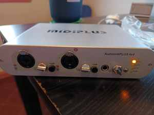
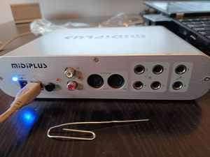

# Midiplus AudioLink Plus II

La Midiplus AudioLink Plus II se convirtió en uno de los casos más representativos de ISLA porque obligó a bajar hasta la capa del kernel para conservar hardware perfectamente utilizable.





## El problema

La interfaz no disponía de soporte GNU/Linux satisfactorio para el uso buscado. En lugar de descartarla, se trabajó sobre el driver libre **Ozzy** para incorporar soporte específico.

El proceso incluyó identificación USB, análisis de endpoints, inicialización y handshake, soporte de audio, MIDI, pruebas SysEx, instrumentación y herramientas de loopback/sniffing.

## El fallo SysEx

Durante las primeras pruebas, los mensajes SysEx largos se truncaban. Se revisó el camino de transmisión MIDI del driver y se implementó una gestión más robusta de buffer, cola y fases de envío.

```text
80 bytes    TX == RX
512 bytes   TX == RX
1024 bytes  TX == RX
4096 bytes  TX == RX
```

El resultado no fue sólo “hacer andar una placa”. Demostró un principio central:

> **La falta de soporte comercial no convierte automáticamente al hardware en residuo electrónico.**

Cuando el código puede estudiarse y modificarse, el límite deja de estar fijado por la decisión comercial de un fabricante.
