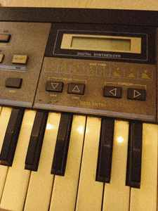
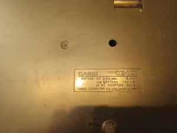
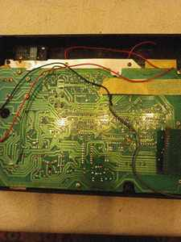
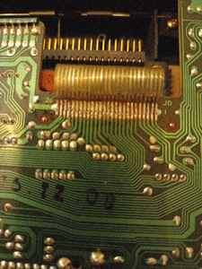
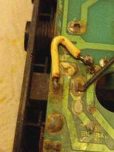
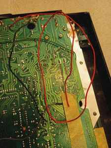
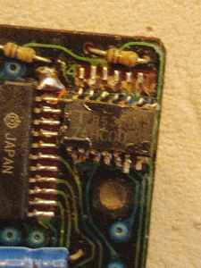
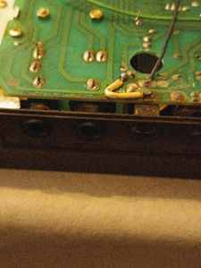
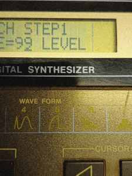

# Casio CZ-101

El Casio CZ-101 es una de las piezas que mejor resume la filosofía de ISLA: restauración física, estudio de MIDI/SysEx, preservación de sonidos históricos y creación de herramientas libres alrededor de hardware de los años 80.



*El panel del CZ conserva en serigrafía parte de la gramática de síntesis que décadas después volvió a representarse en el librarian.*

## Estado del instrumento

Durante la recuperación se encontraron problemas propios de décadas de almacenamiento y uso: suciedad interna, portapilas afectado por derrames, problemas mecánicos y contactos, memoria dependiente de alimentación de respaldo, componentes del cartucho que requerían reparación y jacks/potenciómetros a revisar.



*La documentación fotográfica del estado original forma parte de la preservación: modelo, alimentación y detalles físicos quedan registrados antes de intervenir.*

## Interior y diagnóstico














Estas imágenes no son sólo ilustrativas: conservan orientación de conectores, cableado y estado previo a cualquier reparación.

## Patches manuscritos


*Anotaciones conservadas desde los años ochenta. Los parámetros escritos a mano se están transformando nuevamente en datos estructurados y patches SysEx.*

```text
hoja original
    ↓
transcripción
    ↓
modelo estructurado del patch
    ↓
SysEx
    ↓
CZ-101 real
```

## Librarian Web MIDI

Se desarrolló un librarian/editor web para operar el sintetizador desde GNU/Linux mediante Web MIDI. El trabajo incluyó detección MIDI, permisos SysEx, Program Change, envío y recepción de SysEx, modelado de parámetros y representación visual de formas de onda.



El librarian no intenta reemplazar al CZ: **permite que el CZ siga siendo utilizable**.

## Rol dentro de MusE

Dentro de ISLA, el CZ se representa mediante una pista MIDI que envía notas y control y una pista de audio que recibe la salida física del sintetizador.


Así puede secuenciarse, grabarse y procesarse junto con instrumentos virtuales libres.
