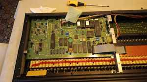

# Ensoniq SQ-1 y archivos históricos

El Ensoniq SQ-1 aporta a ISLA un problema diferente: no sólo preservar un instrumento, sino también recuperar el ecosistema de almacenamiento utilizado con él.



*El SQ-1 abierto durante la inspección. Además de la electrónica, el proyecto conserva la relación con patches, secuencias y soportes históricos.*

## Estado del instrumento

El SQ-1 continúa funcionando, aunque requiere mantenimiento: batería de respaldo agotada y una tecla grave sin respuesta.

Durante su uso original se almacenaron patches, bancos SysEx y secuencias mediante un secuenciador hardware Brother con disquetes de 3½ pulgadas. Todavía se conservan tanto la unidad como numerosos disquetes.

## Estrategia de recuperación

```text
disquete original
      ↓
inspección física
      ↓
lectura no destructiva
      ↓
imagen maestra
      ↓
checksum
      ↓
copias de trabajo
      ↓
análisis de formato
      ↓
extracción de SysEx / secuencias
```

Los discos originales no deben utilizarse como superficie de experimentación. Una vez obtenida una imagen confiable, cualquier análisis debe realizarse sobre copias.
